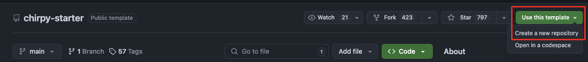
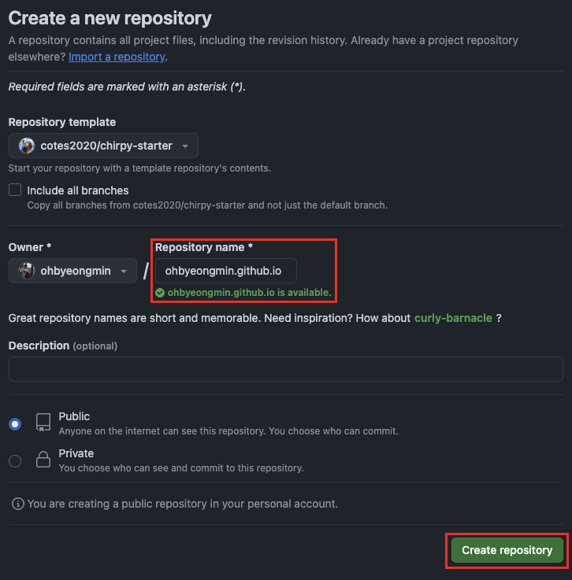
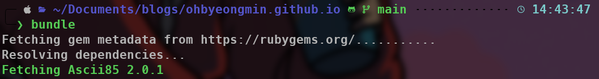
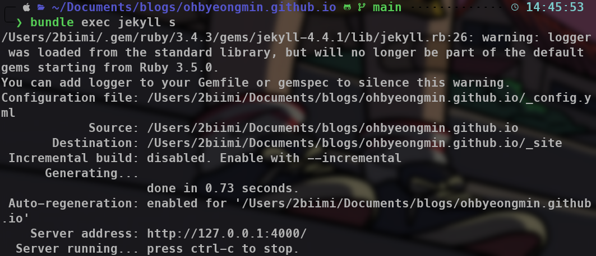
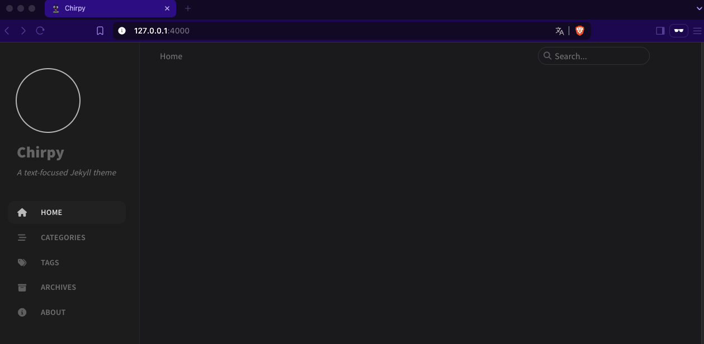
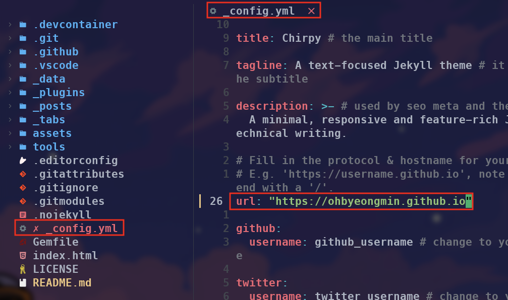
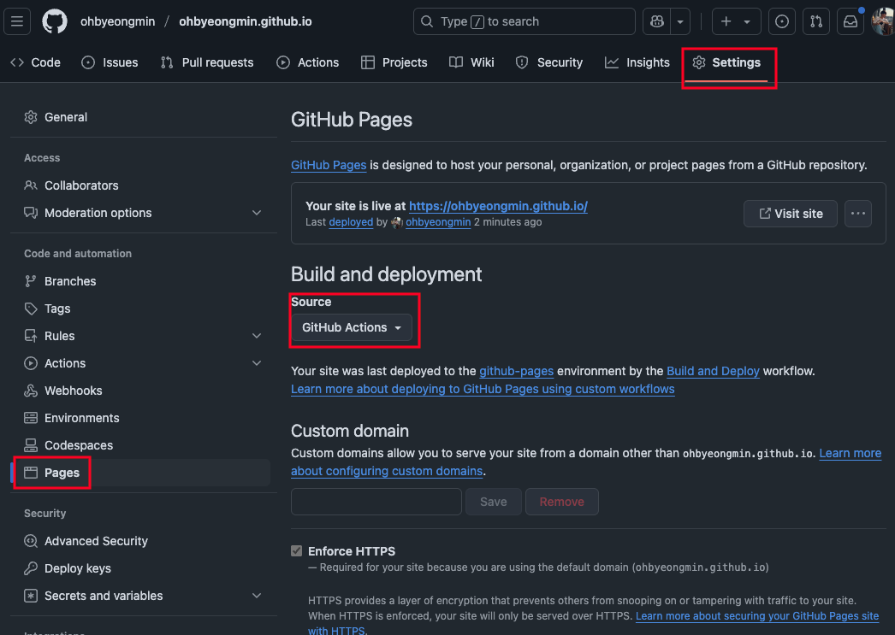
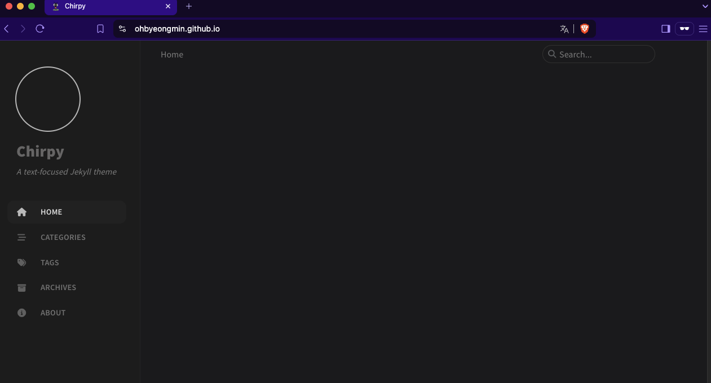

# Introduction

Jekyll 는 정적 사이트 생성기(Static Site Generator) 입니다. 다시 말해, Markdown이나 HTML 파일로 작성한 콘텐츠를 정적인 웹사이트로 만들어주는 도구입니다. 주로 블로그나 기술 문서 사이트를 만들 때 적합합니다.

Jekyll는 루비 언어로 만들어졌고, Github Pages를 사용해 무료 호스팅하기에 적합합니다.

블로그를 시작해보자 마음먹고 어떤 플랫폼을 사용할지 고민하던 중, 요즘 Github Pages를 활용해 운영중인 블로그를 많이 보게되어 Jekyll 를 사용해서 만들어보기로 했습니다.

Jekyll 를 사용해서 만든 다양한 테마 템플릿이 많이 있습니다. 그 중에서 Github stars를 많이 받은 테마 중 Chirpy 테마가 가장 깔끔하고 개인적인 기술 블로그를 쓰기에 적합하다고 생각하여 선택했습니다.

# 설치 방법

Jekyll Chirpy 를 설치하려면 두가지 옵션이 있습니다.

- Starter 사용
    
    이 방식은 업그레이드를 최대한 간소화 하고 불필요한 파일을 분리하여 최소한의 구성으로 글쓰기에 좀 더 집중하고 싶은 유저에게 적합합니다.
    
- 테마 레포지터리 포킹
    
    이 방식은 블로그 기능이나 UI 디자인을 수정할 때 편리한 방법입니다. 그러나 업그레이드 과정에서 문제가 발생할 수 있고 Jekyll 에 익숙하지 않거나 테마를 크게 수정할 계획이 없다면 사용을 지양하는게 좋습니다.
    

본 글에서는 Starter를 사용하는 방법으로 설치를 진행합니다.

## 레포지터리 만들기

1. Github의 [chirpy-starter](https://github.com/cotes2020/chirpy-starter) 레포지터리로 이동합니다. (Github 계정이 없으면 만들어야 합니다.)
2. 우측 위에 있는 `Use this template` 을 클릭하고 `Create a new repository` 를 선택 합니다.
    
    
    
3. 레포지터리의 이름을 `<username>.github.io` 로 지어 줍니다. 저는 유저 네임인 `ohbyeongmin` 을 넣었습니다. 그리고 `Create repository` 버튼을 클릭하여 레포지터리를 만듭니다.
    
    
    

## 개발 환경 설정

레포지터리가 성공적으로 만들어졌다면, 배포 환경을 설정해야 됩니다. 여기에도 두가지 방법이 존재합니다.

- Dev Containers 사용
    
    이 방법은 도커 컨테이너 플랫폼을 사용하여 배포 환경을 설정 합니다. Windows 유저에게 적합한 방법 입니다.
    
- Natively 설정
    
    Unix 시스템 사용자에게 적합한 방법 입니다.
    

저는 MacOS를 사용하기 때문에 Natively 방식을 사용하겠습니다. 이 방식은 먼저 로컬에 Jekyll 를 설치해야 됩니다. 이 과정에서는 Jekyll 를 설치하고 로컬에서 서버를 돌리는 과정을 설명하겠습니다.

### Jekyll 설치

1. MacOS의 패키지 매니저인 Homebrew를 설치 합니다.
    
    ```bash
/bin/bash -c "$(curl -fsSL https://raw.githubusercontent.com/Homebrew/install/HEAD/install.sh)"
    ```
    {: .nolineno }
    
2. `chruby` 와 `ruby-install` 을 설치 합니다.
    
    ```bash
brew install chruby ruby-install
    ```
    {: .nolineno }
    
3. 루비의 최신 stable 버전을 설치 합니다. stable 버전은 [루비 다운로드 페이지](https://www.ruby-lang.org/en/downloads/)에서 확인할 수 있습니다.
    
    ```bash
ruby-install ruby 3.4.3
    ```
    {: .nolineno }
    
4. 설치가 끝나면 `chruby` 를 사용하여 쉘 환경을 구성해야 됩니다.
    
    ```bash
echo "source $(brew --prefix)/opt/chruby/share/chruby/chruby.sh" >> ~/.zshrc
echo "source $(brew --prefix)/opt/chruby/share/chruby/auto.sh" >> ~/.zshrc
echo "chruby ruby-3.4.3" >> ~/.zshrc
    ```
    {: .nolineno }
    
    주의할 점은 본인이 사용하는 쉘 환경에 맞게 구성해야 됩니다. 위 예제는 `zsh` 환경 입니다. Bash 쉘을 사용한다면 `.bash_profile` 로 바꿔야 합니다. 어떤 쉘을 사용하고 있는지 모르면 다음 명령어로 현재 사용하고 있는 쉘이 뭔지 확인할 수 있습니다.
    
    ```bash
echo $0
    ```
    {: .nolineno }
    
    구성이 끝났으면, 다음 명령어를 통해 현재 쉘에 수정된 환경을 로드 해옵니다.
    
    ```bash
source ~/.zshrc
    ```
    {: .nolineno }
    
    다음 명령어로 루비가 정상적으로 설치 됐는지 확인합니다. 루비 버전이 정상적으로 출력되어야 합니다.
    
    ```bash
ruby -v
    ```
    {: .nolineno }
    
5. gem을 사용하여 Jekyll 설치 합니다.
    
    ```bash
gem install jekyll
    ```
    {: .nolineno }
    

### Local 에서 Jekyll 서버 시작하기

1. Github에 만든 레포지터리를 클론합니다. 본인 주소에 맞게 `<username>` 부분을 바꿔서 진행해주세요.
    
    ```bash
git clone https://github.com/<username>/<username>.github.io.git
    ```
    {: .nolineno }
    
2. 레포지터리의 root에서 `bundle` 명령어를 사용해서 의존성 패키지를 설치합니다.
    
    ```bash
bundle
    ```
    {: .nolineno }
    
    
    
3. 다음 명령어를 통해 로컬에서 서버를 실행할 수 있습니다.
    
    ```bash
bundle exec jekyll s
    ```
    {: .nolineno }
    
    
    
4. [`http://127.0.0.1:4000/`](http://127.0.0.1:4000/) 로 웹사이트에 접속할 수 있습니다.
    
    
    

## Github Actions 을 사용하여 블로그 배포하기

1. Github pages를 사용해서 블로그를 호스팅 하기 위해선 우선 `_config.yml` 파일에 `url` 을 올바르게 입력해야 된다. Github pages 의 기본 url 은 `https://<username>.github.io` 이다. 본인에 맞게 설정하면 된다.
    
    
    
2. 수정을 완료하고 변경사항을 커밋하고 레포지터리에 푸시 해줍니다.
    
    ```bash
git add . 
git commit -m "Update url" 
git push origin -u main
    ```
    {: .nolineno }
    
3. Github 레포지터리로 돌아가서 위에 `Settings` 탭을 클릭하고, 왼쪽 네비게이션 바의 `Pages` 로 들어갑니다. 그리고 `Source` 섹션에서 `Github Actions` 를 선택하면 배포가 완료됩니다. 이 작업 이후 블로그에 업데이트가 있을 경우 커밋을 Github에 푸시하게 되면 자동으로 변경사항이 블로그에 적용되어 자동으로 배포가 됩니다.
    
    
    
4. `https://<username>.github.io` 이 주소로 블로그에 접속할 수 있습니다. 이제 전세계에 본인의 블로그를 호스팅 하게 됐습니다!
    
    
    
>블로그에 콘텐츠를 작성하고 로컬 환경에서 업데이트된 콘텐츠를 먼저 확인을 하고 레포지터리에 커밋을 푸시 하세요. 배포 시간을 절약 할 수 있고 깔끔하게 커밋을 관리할 수 있습니다.
{: .prompt-tip}
    

# 참고

- Jekyll 공식 문서: [https://jekyllrb.com/docs/installation/](https://jekyllrb.com/docs/installation/)
- Jekyll-chirpy 가이드: [https://chirpy.cotes.page/posts/getting-started/](https://chirpy.cotes.page/posts/getting-started/)
